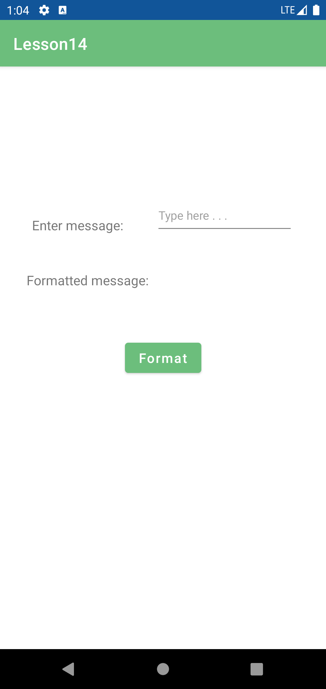
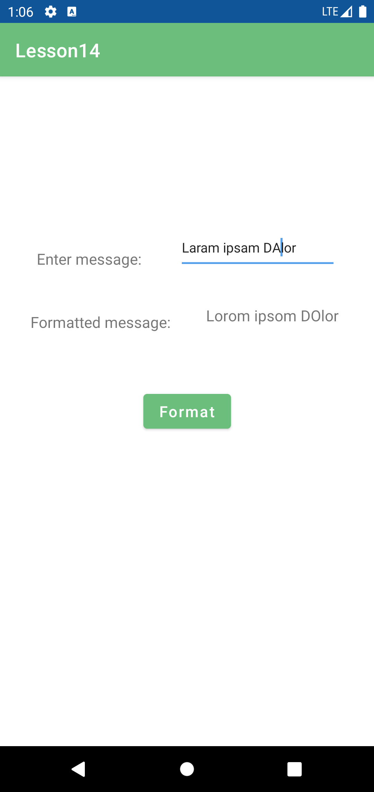
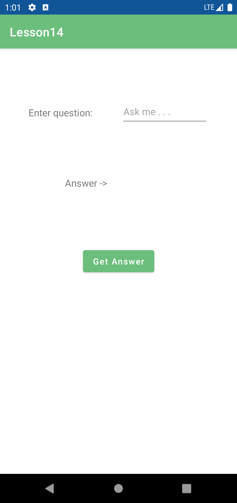
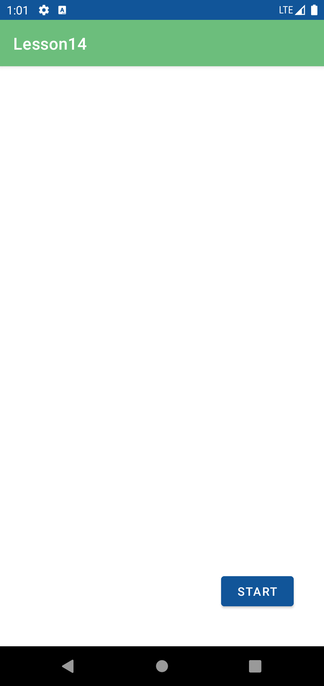
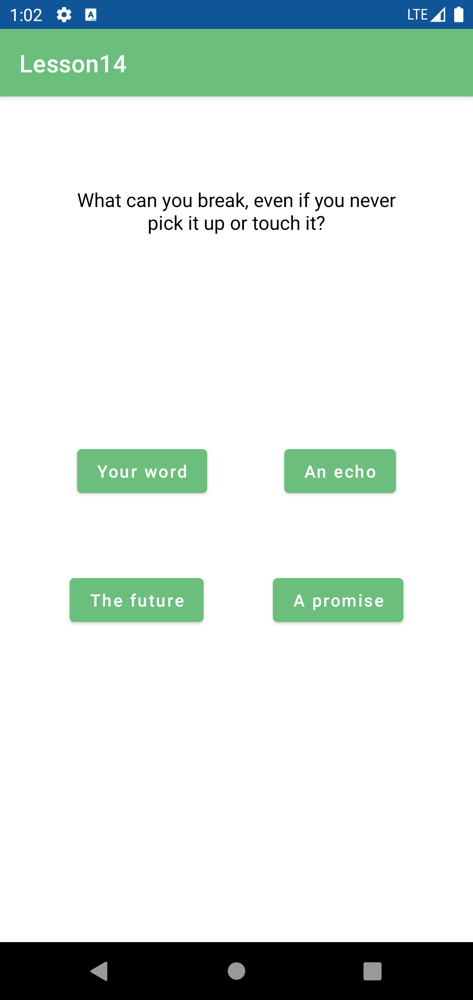
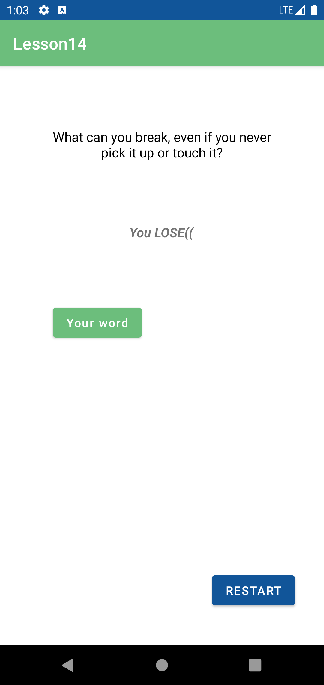
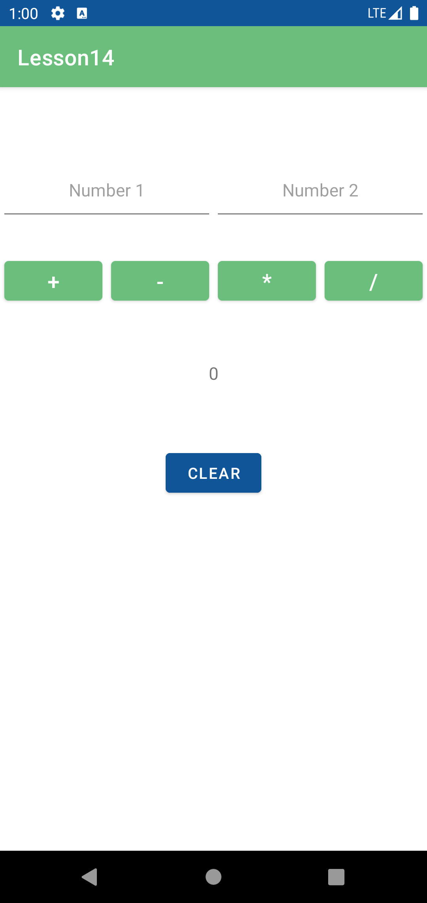

# Homework 14

Launcher Activity

This homework contains four mini apps:

* TextFormatter - replaces all 'A'/'a' characters to 'O'/'o';

 
  
* MagicBall - gives answers on life question;

  
* Riddles - asks riddles;

  
  
* Calculator - can do four mathematical actions(+, -, *, /) with two numbers.

